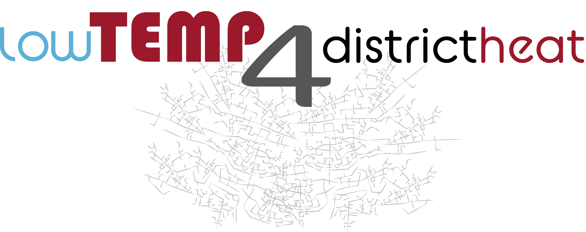

<!-- Improved compatibility of back to top link: See: https://github.com/othneildrew/Best-README-Template/pull/73 -->
<a name="readme-top"></a>
<!--
*** Thanks for checking out the Best-README-Template. If you have a suggestion
*** that would make this better, please fork the repo and create a pull request
*** or simply open an issue with the tag "enhancement".
*** Don't forget to give the project a star!
*** Thanks again! Now go create something AMAZING! :D
-->


<!-- PROJECT SHIELDS -->
<!--
*** I'm using markdown "reference style" links for readability.
*** Reference links are enclosed in brackets [ ] instead of parentheses ( ).
*** See the bottom of this document for the declaration of the reference variables
*** for contributors-url, forks-url, etc. This is an optional, concise syntax you may use.
*** https://www.markdownguide.org/basic-syntax/#reference-style-links
-->
[![Contributors][contributors-shield]][contributors-url]
[![Forks][forks-shield]][forks-url]
[![Stargazers][stars-shield]][stars-url]
[![Issues][issues-shield]][issues-url]
[![License][license-shield]][license-url]
[![LinkedIn][linkedin-shield]][linkedin-url]


<!-- PROJECT LOGO -->
<br />
<div align="center">
  <a href="https://www.4wardenergy.at/en/references/lowtemp4districtheat">
    
  </a>

</div>


<!-- TABLE OF CONTENTS -->
<details>
  <summary>Table of Contents</summary>
  <ol>
    <li>
      <a href="#about-the-project">About The Project</a>
    </li>
    <li><a href="#about-the-simulation">About the Simulation</a></li>
    <li>
      <a href="#getting-started">Getting Started</a>
      <ul>
        <li><a href="#prerequisites">Prerequisites</a></li>
        <li><a href="#installation">Installation</a></li>
      </ul>
    </li>
    <li><a href="#usage">Usage</a></li>
    <li><a href="#license">License</a></li>
    <li><a href="#contact">Contact</a></li>
    <li><a href="#acknowledgments">Acknowledgments</a></li>
  </ol>
</details>


<!-- ABOUT THE PROJECT -->
## About The Project

![product-screenshot]

Welcome to the GitHub repository for the "lowTemp4districtheat" project! This project is dedicated to simulating district heating networks, motivated by the transition to low-temperature operations with multiple feeders that enhance efficiency and reduce environmental impact. The simulation framework is designed to be flexible, allowing users to configure various parameters to model different scenarios in district heating systems.

The software is structured so that the `main.py` script serves as the primary entry point for running simulations. It includes modules for data preparation (data_prep) and simulation processes (simulation), ensuring that users can easily manage and execute complex simulations. The examples directory offers practical examples to help users understand how to utilize the software effectively for their specific needs.

Aimed at researchers and planning engineers in the field of energy and heating systems, this tool provides a comprehensive platform for simulating district heating networks with or without decentralised feeders. It is capable of calculating the pressures and temperatures in any point of the network. Sophisticated gap-filling algorithms ensure that the simulation can handle missing data while still providing accurate results.

To get started, please follow the installation instructions below and refer to the example scripts provided.

<p align="right">(<a href="#readme-top">back to top</a>)</p>

## About the Simulation
Simulation of district heating networks is a complex task that requires the consideration of various factors, including the network's topology, consumer and feeder data, and the heat demand of consumers. Below is an attempt to illustrate the application logic and data flow in a simplified flowchart. 

![flowchart]

The main program is executed when pressing **"Start simulation"** in the GUI. It reads in the network topology from the provided Excel file and the prepared historical feeder and consumer data. After that, the program enters the main loop. In the main loop, volumetric flow and heat flow balances are calculated and written into the output Excel file. Next, missing values are imputed using automatically chosen gapfilling algorithms. The simulation then calculates the hydraulic solution for the current hydraulic time step before iterating over the thermal time steps and calculating the thermal solutions until the next hydraulic time step is reached. The simulation then proceeds to the next hydraulic time step and repeats the process until the end of the simulation period is reached. Per default, the hydraulic time step is set to 15 minutes and the thermal timestep is set to 5 seconds. After exiting the main loop, the simulation results are saved in the output Excel file. There is also an option to cache results after a specified time period in case the simulation is interrupted.

Pressing **"Data preparation"** in the GUI starts the data preparation routine, which prepares the raw data into a format suitable for the simulation. During this process, the standard load profiles are individualised based on the historical consumption data or, if the historical data is insufficient, based on static information from the network topology. 

Pressing **"Calculate ML models"** in the GUI starts the machine learning model training routine, which trains machine learning models to predict the heat demand of consumers based on historical data. This requires at least one winter of good quality measurements. The routine will automatically decide whether to train a model for a given consumer. You can override this and force the training of all models with available historical data in the GUI. During the training routine, the best-suited gapfilling routine is chosen for the given consumer and written to the input Excel file.

<p align="right">(<a href="#readme-top">back to top</a>)</p>


<!-- GETTING STARTED -->
## Getting Started
To get a local copy up and running, follow these simple steps:


### Prerequisites
- **Python:** The project is developed in Python. Ensure you have Python 3.7 or later installed on your system. You can download it from [python.org](https://www.python.org).
- **pip:** Ensure that Python's package manager, pip, is installed. pip usually comes with Python, but if you need to install it, follow the instructions at [pip.pypa.io](https://pip.pypa.io).

### Installation

#### 1. Clone the Repository
First, you need to clone the repository from GitHub to your local machine. Open your command line interface (CLI) and run the following command:
```bash
git clone --depth=1 https://github.com/4wardEnergyResearch/lowTEMP4districtheat.git
cd lowTEMP4districtheat
```
#### 2. Set Up a Virtual Environment (Recommended)
It's recommended to use a Python virtual environment to avoid conflicts with other packages and manage dependencies efficiently. If you don't have virtualenv installed, you can install it using pip:
```bash
pip install virtualenv
```
Create and activate a virtual environment in the project directory:
##### For Windows
```bash
python -m venv env
env\Scripts\activate
```
##### For macOS and Linux
```bash
python3 -m venv env
source env/bin/activate
```

#### 3. Install dependencies
Once the virtual environment is activated, install the project dependencies using:
```bash
pip install -r requirements.txt
```

#### 4. Verify installation
To verify that the installation was successful, you can run the `main.py` script:
```bash
python main.py
```
If there are no errors and the GUI opens successfully, your installation is complete.

<p align="right">(<a href="#readme-top">back to top</a>)</p>


<!-- USAGE EXAMPLES -->
## Usage
### Basic Usage instructions
To use the software, follow these steps:

1. **Starting the Application**:
   - Run `main.py` to launch the graphical user interface. This can typically be done by navigating to the project directory and executing the command `python main.py` in your terminal or command prompt.
   - If you want to set any advanced options (simulation time steps, data folder locations, water density, ...), do so in the `options.py` file prior to running `main.py`.

![GUI-screenshot]

2. **Selecting Input Files**:
   - Use the 'Select File' button to choose the required `.xlsx` file for the simulation. This file should contain the necessary data for processing.

3. **Setting Simulation Parameters**:
   - Input the year based on which the Standard Load Profiles (SLP) should be calculated in the provided input field. This ensures that the simulation uses the correct data corresponding to that year.
   - The interface will provide real-time validation of the year and file selection, highlighting in green or red to indicate if running the data preparation routine is necessary or not.
   - Also, the software checks for the availability of necessary machine learning models and displays the status. If any models are missing, the software will notify you of what is missing and the 'Confirm' button will be disabled until all required models are available.

4. **Defining the simulation period**
   - Set the simulation start and end time in the respective fields.

5. **Running the Simulation**:
   - Once the input file is selected, you can proceed by clicking on various operational buttons:
     - **Prepare Data**: Prepares the data for simulation if required.
     - **Calculate ML Models**: Initiates the calculation of machine learning models if required.
     - **Start Simulation**: Begins the simulation process.
    
6. **Output Options**:
   - The GUI provides options to select the type of output you desire, including:
     - Visualisation of results.
     - Real-time data output (this is not implemented yet).
     - Caching interval for the output excel file.
    
7. **Running the Simulation**:
   - After setting all parameters and ensuring all configurations are correct, use the 'Start Simulation' button to begin the process. The GUI will provide updates and results based on the simulation settings.
  
### Running the simulation with an exemplary data set
We have provided to exemplary network topologies to test the simulation with. The `options.py` file is set to use the `/examples` directory as the data directory by default, so you can just select an `.xlsx` file from `/examples/IN_topologies` and run the simulation. For reasons of data protection, we can not provide individualized standard load profiles or machine learning models. You will have to train these on your own data. The data preparation and ML training routines will not work with the provided exemplary data. For testing purposes, you can ignore the red warnings in the GUI and proceed by checking the "Visualisation" box and clicking "Start Simulation". Don't be alarmed if the thermal solution seems "off" in the first couple of hours - the simulation needs a certain burn-in time. The exemplary data is synthetic and provided for the standard simulation timeframe of the GUI (2022-12-29 00:05 to 2022-12-30 00:05).

1. **Start the application**
2. **Select the network topology file** from `/examples/IN_topologies`
3. **Check the "Visualisation" box** if you want to see some graphics
4. **Click "Start Simulation"**. The simulation now runs with the provided data and will save the results in the `/examples/IN_topologies` directory. Running the simulation may take a while, depending on your machine's performance and whether you have selected the "Visualisation" option.

### Running the simulation with your own data
1. **Prepare network topology**
Enter the desired network topology via an input Excel file. Two examples can be found in the `/examples/IN_topologies` folder, along with further documentation on the structure of this file. 
2. **Prepare historical data**
Historical consumer and feeder data is supplied to the simulation in the form of Cone CSV file per consumer/feeder. The data preparation routines were developed for a specific input format. You may have to adapt your input data to follow the format. An exemplary input file can be found in the `/examples/IN_raw_data` directory.
3. **Run data preparation routine**
Select your network topology file and run the data preparation routine from the GUI to prepare your data for the simulation. This will generate new csv files in the `examples/OUT_prepared_data` directory. These CSV files, together with the network topology file, are used as input for the simulation.
The data preparation routine will also generate the necessary standard load profiles for gapfilling, based on the HOTMAPS standard load profiles and the historical consumption from the "SLP year" you specify. If the historical consumption is not available for the specified year, the routine uses values from the network topology to estimate the yearly consumption (see `examples/IN_topologies/info.md` for details). These are saved in the `examples/OUT_load_profiles/individual` directory.
4. **Train machine learning models**
The simulation uses machine learning models to predict the heat demand of consumers and feeders. The models are trained on the prepared data. Run the machine learning training routine from the GUI to train the models. It can only be trained for models with at least one full winter of data available and will decide automatically whether to train a model for given consumer. The model training can take up to several hours, depending on your machine's performance as well as the number of models to train. The trained models are saved in the `examples/OUT_ml_models` directory.
5. **Run the simulation**
Set the start and end date for the simulation and run it. The simulation will use the prepared data and trained models to simulate the district heating network's operation and save the results in an Excel file in the `examples/IN_topologies` directory.

#### Quickstart
If you are confident that your data is evenly spaced and without gaps, you can skip steps 3 and 4 and provide the historical data directly in the `examples/OUT_prepared_data` folder in the format specified there. The simulation will then use this data directly without the need for data preparation or machine learning training.

### Visualisation
If you check the "Visualisation" box in the GUI, the simulation will generate visualisations of the network's operation in two windows:
#### 1. Hydraulic solution visualisation
Updates with every hydraulic timestep and shows the nodes and pipes in the network. Feeders have a red border, consumers and ditributor nodes are borderless. The nodes scale with their mass flow rate and are coloured according to their pressure. Inactive nodes (no mass flow at the given time step) are shown as transparent. Distributor nodes are smaller than consumers.
#### 2. Thermal solution visualisation
Updates with every thermal timestep and shows the network's pipes, coloured according to their temperature. 

The visualisations are saved as individual `.png` files for each time step in the `examples/OUT_visualisations` directory.

The visualisation shows the temperature in the network's pipes and the heat flow in the network's pipes and consumers. The visualisation is saved as a `.png` file in the `examples/IN_topologies` directory.

### Additional information
Additional information about the project structure can be found in the `info.md` files in the project's subfolders.

<p align="right">(<a href="#readme-top">back to top</a>)</p>

<!-- LICENSE -->
## License

[GNU General Public License v3.0](https://www.gnu.org/licenses/gpl-3.0.html.en)

<p align="right">(<a href="#readme-top">back to top</a>)</p>


<!-- CONTACT -->
## Contact
**TBD**
Your Name - office@4wardenergy.at

[Project website](https://www.4wardenergy.at/en/references/lowtemp4districtheat)

<p align="right">(<a href="#readme-top">back to top</a>)</p>


<!-- ACKNOWLEDGMENTS -->
## Acknowledgments
The project is funded within the “Stadt der Zukunft – 7th Call” funding program by the Federal Ministry for Climate Protection, Environment, Energy, Mobility, Innovation and Technology.
<table>
  <tr>
    <td></td>
    <td></td>
  </tr>
</table>

This project made use of the following resources:
* [HOTMAPS Project](https://www.hotmaps-project.eu/): The expansive space heating and SHW load profiles generated in the HOTMAPS allow for the SLP gapfilling mode implemented in this project.
* [copy_xlsx_styles - Sydney Informatics Hub](https://github.com/Sydney-Informatics-Hub/copy_xlsx_styles): This GitHub repository offered a Python utility that enabled us to maintain consistent styling in the Excel reports generated by the simulation.

<p align="right">(<a href="#readme-top">back to top</a>)</p>


<!-- MARKDOWN LINKS & IMAGES -->
<!-- https://www.markdownguide.org/basic-syntax/#reference-style-links -->
[contributors-shield]: https://img.shields.io/github/contributors/4wardEnergyResearch/lowTEMP4districtheat.svg?style=for-the-badge
[contributors-url]: https://github.com/4wardEnergyResearch/lowTEMP4districtheat/graphs/contributors
[forks-shield]: https://img.shields.io/github/forks/4wardEnergyResearch/lowTEMP4districtheat.svg?style=for-the-badge
[forks-url]: https://github.com/4wardEnergyResearch/lowTEMP4districtheat/network/members
[stars-shield]: https://img.shields.io/github/stars/4wardEnergyResearch/lowTEMP4districtheat.svg?style=for-the-badge
[stars-url]: https://github.com/4wardEnergyResearch/lowTEMP4districtheat/stargazers
[issues-shield]: https://img.shields.io/github/issues/4wardEnergyResearch/lowTEMP4districtheat.svg?style=for-the-badge
[issues-url]: https://github.com/4wardEnergyResearch/lowTEMP4districtheat/issues
[license-shield]: https://img.shields.io/github/license/4wardEnergyResearch/lowTEMP4districtheat.svg?style=for-the-badge
[license-url]: https://github.com/4wardEnergyResearch/lowTEMP4districtheat/blob/master/COPYING.txt
[linkedin-shield]: https://img.shields.io/badge/-LinkedIn-black.svg?style=for-the-badge&logo=linkedin&colorB=555
[linkedin-url]: https://linkedin.com/company/4ward-energy-research-gmbh
[product-screenshot]: images/visualisation.png 
[GUI-screenshot]: images/GUI.png
[bmk-logo]: images/BMK_Logo.png
[ffg-logo]: images/FFG_Logo_DE_RGB_1500px.png
[flowchart]: images/flowchart.png
